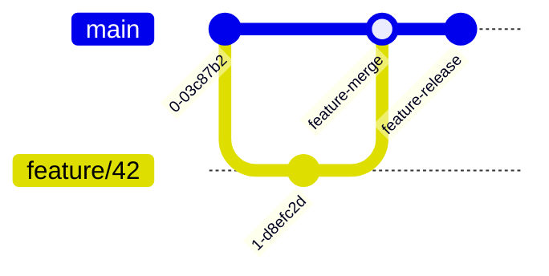
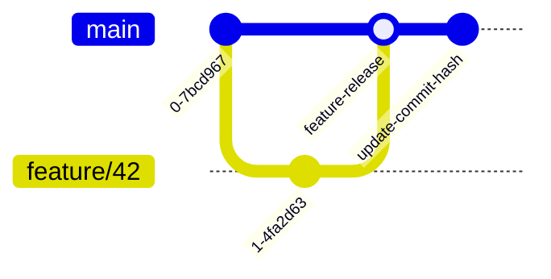

# Kætər Tooling

This module holds the `kaeter` cli monorepo tool.
`kaeter` provides a generic way to version and release software modules
or _deliverables_, be they docker images, go binaries, jars or whatnot.

> Caterpillars /ˈkætərˌpɪlər/ are the larval stage of members of the order Lepidoptera (the insect order comprising butterflies and moths).

## Purpose

The `kaeter` CLI seeks to enable _descriptive releases_ and to provide an answer to this:

> How do I release this and what is the next version number?

While striving to do so in a way that integrates nicely with any CI:
- it allows to developpers to _request_ the release of something, and then to have the CI do the actual release,
- it does not require the CI to push anything to the repo, like an updated version or a release commit.

The tool is aimed at mono/big repositories with multiple _deliverables_ living side by side, but is also regularly used on small repos.

This CLI tool has these goals:

- implementation of a generic folder based module system within a code respository
- providing a standardised release process in a monorepo context
- tracking released versions
- providing a _just type this command to trigger a release_ interface to release anything

## Modules

Kaeter is centered around the concepts of multiple modules within a single repository. Each module information on:

- How it needs to be built, tested and released
- What versions were released and from which commit hashes they were released from
- Additional metadata to customize module behavior and requirements

Any folder can be a kaeter module as long as it has the following files:

- `versions.yaml`¹
- `CHANGELOG.md`²
- `Makefile.kaeter` or `Makefile`
- `README.md`

¹: This file is used for detection. Any folder with a file matching that name will be considered a module.

²: Alternatives also supported: `CHANGES` file or a spec file with a `%changelog` section.

### Configuring modules `versions.yaml`

The versions file is mainly used to store released versions or too be released versions.

Released versions are described in an unambiguous way, this description includes:

- Version number
- Date of release
- Commit Reference hash

The main reason for storing versions in this file is to avoid relying on git tags which
would be hard to scale to a monorepo with many projects releasing (the tags would need to contain the module ids).
So instead of tags having names and commit references we store the same information in a file respective to each module.

The file also contains the module id and some configuration for each module (versioning type, ...)

### Defining targets in `Makefile.kaeter`

`kaeter` currently works with Makefiles, in which it expects to find following targets:

- `build`
- `test`
- `release`
- `snapshot` (optional: your toolchain expects this, `kaeter` does not need it)

A `VERSION` environment variable set to the version being currently released will be passed to all targets when they are run,
as if you were calling  `make <target> -e VERSION=<version>`.

The `build` and `release` steps need to explicitly build //everything// that is required for the released module to be useable.

## CI/CD, change detection and releases

The commands under `kaeter ci` can be used to write scripts allowing a pipeline to detect changes, build modules
and make releases.

### Change detection

`kaeter ci detect-changes` can be used to gather information

For example to detect changes between the current branch and the trun (in this case `main`) the following
command can be used:
```shell
kaeter ci detect-changes \
          --path "/abs/path/to/git/repository" \
          --previous-commit "$(git merge-base main HEAD)" \
          --latest-commit "HEAD" \
          --changes-output /tmp/changeset.json \
          --modules-output /tmp/kaeter-modules.json
```

- `/tmp/kaeter-modules.json` will simply contain a list of all modules detected in the repository
- `/tmp/changeset.json` will contain different sections with a lot of information:
  - `Files` contains the list of files changed in the repository between the 2 commits, this can be used for example to lint files with changes
  - `Commit` parses various information from the commit messages
  - `Kaeter` information about modules that have changes (based on `Files` and detected modules)
  - `Helm` information about modules with changes containing helm charts
  - `PullRequest` if provided with `--pr-title` and `--pr-body` will parse information from the pull request as well

### Building based on change detection

The `kaeter-modules.json` file could be used to build everything. If we only want to build modules with changes
`Kaeter` section of the changeset can be used to navigate to these modules in the pipeline and build them using
the required makefile targets.

### Requesting releases and releasing in CI

The base constraints are:
- Only code that currently exists on the remote trunk branch may be subject to a release.
- Release version numbers and anything required to identify a release is stored in git.
- Releases are requested using either file changes or metadata in commit messages

Kaeter currently supports 2 modes for releases:
- An asynchronus release aka prepare & release
- A synchronus release aka autorelease

#### `prepare` & `ci release`

This release flow is based on requesting the release of an existing trunk commit and
was the original kaeter release workflow.

This assumes that the pull request title and description will be used as the squash-merge
commit message. So that the trunk pipeline can read the release plan from the commit message.

Currently, a release plan consists of a simple YAML array named `release`,
which contains an entry for each module to be released:

```markdown
    [release]: ch.open.example:ModuleID version 0.4.2

    ```yaml

    releases:
      - groupId:ModuleId:version
      - nonMavenId:version

    ```
```
This can be parsed in the pipeline to perform the release.

For example:


1. A feature is merged in the commit `feature-merge`
2. A request of `feature-merge` can be requested in a following commit (`feature-release`)
3. The pipeline running from the `feature-release` commit will
    1. Based on the commit message will start a release
    2. Using it it will checkout `feature-merge`
    3. The module will be built, tested and released
    4. The pipeline resets back to `feature-release` and continue with further tacks

This release mode imposes a strict separation between:
- commits with code changes
- commits with release requests

__The 2 cannot be mixed:__ A commit with a release request and a code change will
only release the previous commit so code changes from that commit will not
be included in the build because kaeter will only from trunk commits.

Benefits:
- Easier to implement (no need to have CI create commits)
- Separation between code changes and releases

Downsides:
- Requires 2 commits (or 2 pull requests depending on your workflow)
- Cannot combine code changes with a release request
- Syntax of the commit message is imporant and errors result in skipped releases

#### `autorelease` and `ci release`

This flow is based on requesting a release for a not yet merged commit, with the caviat
that since the hash is not known it must be filled into the `versions.yaml` post merge,
either manually or automatically with a followup commit.

Instead of storing a commit hash in the `versions.yaml`
we use a placeholder:
```yaml
    4.2.0: 2023-29-08T10:32:00Z|AUTORELEASE
```

For example:


1. `kaeter autorelease` updates `versions.yaml` to add the request.
2. Feature is merged in the commit `feature-release`
2. The pipeline running from the `feature-release` commit will
    1. The change to `versions.yaml` and need for a release is detected
    2. No check out is needed, we are on the correct commit: build, test release
3. (Ideally the pipeline will) automatically update `versions.yaml` and replaces `AUTORELEASE` with the correspdonding hash `feature-release`

Benefits:
- Allows combining code changes are releases in the same commit
- Simpler workflow for engineers and less PRs

Downsides:
- Requires the pipeline to be able to automatically update the version hash after release and push changes (non trivial in most cases)

## Dependencies between modules

In a monorepo setup a module might depend on some other path(s) or code to be built.
Kaeter has a notion of path dependencies to trigger a module build for any change in these.

Example `versions.yaml` file:
```yaml
id: ch.open.example:UniqueModuleName
...
dependencies:
    - some/other/path/othermodulename
...
```
Any change in `some/other/path/othermodulename` will trigger `ch.open.example:UniqueModuleName` module to be built.
Note: the path is relative to the repository root.

## Installation

```shell
go install github.com/open-ch/kaeter@latest
```

### Configuration

Kaeter uses [viper](https://github.com/spf13/viper) for config so it will read variables from env and from
`.kaeter.config.yaml` from the detected git repository base on the path flag. This section describes
the important config keys.

**Trunk branch `git.main.branch`:** Kaeter assumes a trunk based workflow and when it needs to work or
query git against trunk (i.e. the release commands) it will use this branch.
```yaml
git.main.branch: origin/main
```

**Init templates `templates`:** These keys allow overriding the default templates when running `kaeter init`.
If not provided kaeter has built-in default templates as fallback. The values available to the go template
are defined in the [`InitializationConfig` struct](modules/init.go)
```yaml
templates:
  default:
    readme:    path/to/README.md.tpl
    changelog: path/to/CHANGELOG.md.tpl
    versions:  path/to/versions.yaml.tpl
    makefile:  path/to/Makefile.kaeter.tpl
```
Custom additional flavors can be defined:
```yaml
templates:
  # ...
  kubernetes:
    readme:    path/to/k8s.README.md.tpl
    changelog: path/to/k8s.CHANGELOG.md.tpl
    # Alternatively, for formats with builtin changelog such as RPM spec files you can use:
    #    skipChangelog: true
    versions:  path/to/k8s.versions.yaml.tpl
    makefile:  path/to/k8s.Makefile.kaeter.tpl
```
and lated used by refering to them using the `--template` flag (i.e. `kaeter init --template kubernetes ...`)

## How To

The genericity is obtained by relying on a `Makefile` declaring four targets, to which a `VERSION` environment variable
will be passed, which will contain the current version being built:

- `build`
- `test`
- `release`
- `snapshot` (optional)

Look at the `kaeter --help` for mor details.

### `kaeter lint`

This command enforces a few things around `kaeter` modules, namely:

- every module (ie, anything that has a `versions.yaml` file) needs `README.md` and `CHANGELOG.md` files,
- every released version needs an entry in `CHANGELG.md` file.

```shell
kaeter lint --path <path_to_repo>
```

### Initialise A Module

To initialise a module living at `my/module`

```shell
kaeter -p my/module init --id com.domain.my:my-module-id
```

### Request A Release

Assuming `my/module` has been initialised and has a compliant `Makefile`, you can prepare a new release like so:

```shell
kaeter -p my/module prepare [ --minor | --major]
```

where without the major or minor switch kaeter increments the third digit(s) of the SemVer version,
second digit(s) with --minor, or the first digit(s) with --major.

It is also possible to prepare multiple modules at the same time by specifying the path parameter (`-p`) multiple times.

### Execute A Release

Assuming the last commit in the repository contains a _release plan_, you may execute said plan with:

```shell
# Without the --really flag a dry run happens
# (ie, all steps except the 'release' one in the Makefile are run)
# With the --nocheckout flag set the commit hash, corresponding to the version of the module,
# will NOT be checked out before releasing
kaeter release --really [--nocheckout]
```

This command is mainly ment to be used by the automated pipeline rather than executed locally. See also `kaeter ci release`.

## History

`kaeter` is the original tool that lets you version and release arbitrary deliverables in a consistent way across a monorepo and/or an organisation.
It was built to be (and is still intended to remain so) useable in a standalone fashion outside of the present repository or Open Systems.

With time, several features that where needed in conjunction with `kaeter` but that did not belong directly were added,
they pertained to quality checks and wider integration with Bazel and the overall CI/CD:

 - quality checks: `kaeter-police` came in to enforce some rules around kaeter's usage. It was eventually refactored inside of kaeter as `kaeter lint`.
 - CI/CD integration: `kaeter ci` commands emerged from the need to understand when a module needed, or didn't need, to be rebuilt.
   Its general purpose is to understand what has changed between two commits: it comes in handy to understand when to release modules but is not strictly linked to `kaeter`.

All in all, the _kaeter tooling_ family was (and still is) intended as something that helps you turn code into deliverables in a monorepo context.

## Additional Notes

We're sorry that the tests published to github don't work yet, as there is some difference
between the internal and the public structure.
